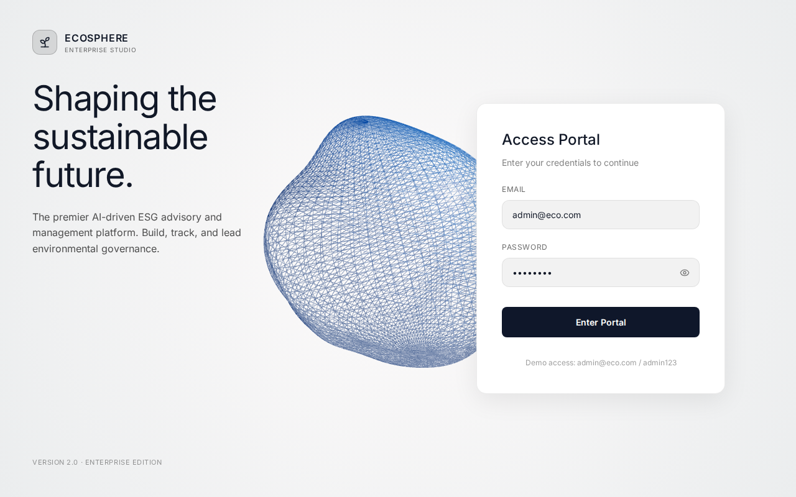
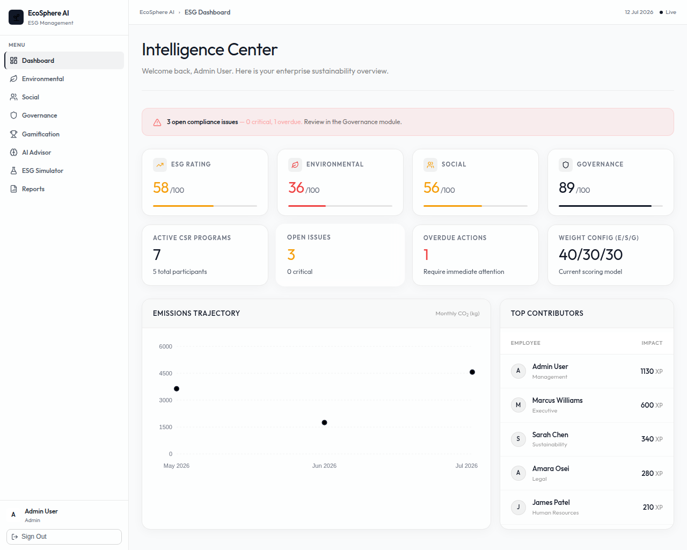
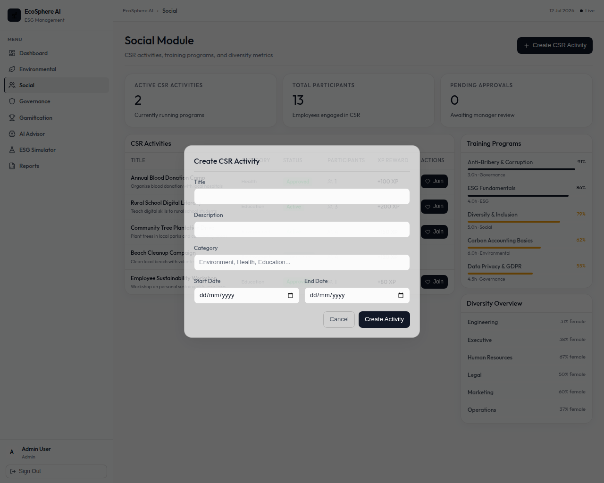
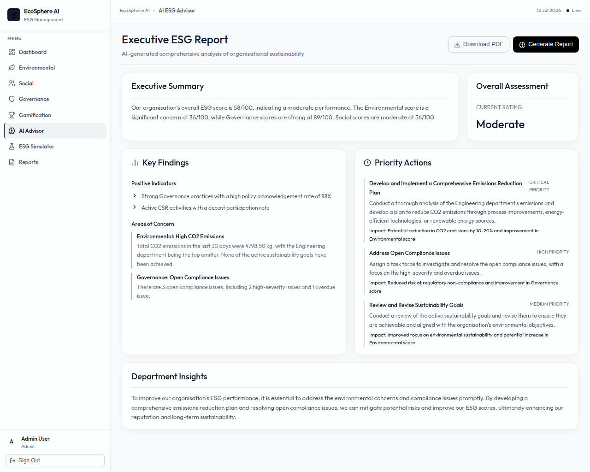
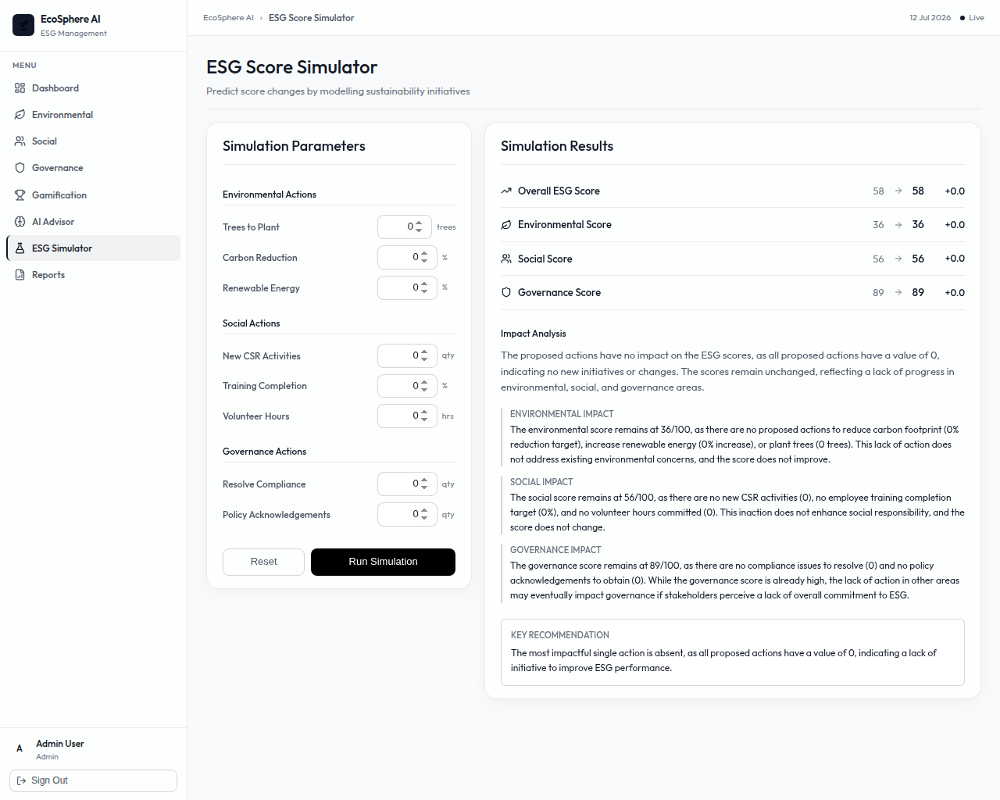

# EcoSphere AI

> Intelligent ESG Management Platform — Odoo Hackathon 2026

## Quick Start

### Prerequisites
- Node.js 18+
- PostgreSQL 14+
- OpenAI API key

### Backend Setup

```bash
cd ecosphere-backend
cp .env.example .env
# Edit .env with your DB credentials and OpenAI key

npm install

# Create and seed the database
psql -U postgres -c "CREATE DATABASE ecosphere_db;"
psql -U postgres -d ecosphere_db -f db/schema.sql
psql -U postgres -d ecosphere_db -f db/seed.sql

npm run dev
# Runs on http://localhost:5000
```

### Frontend Setup

```bash
cd ecosphere-frontend
npm install
npm run dev
# Runs on http://localhost:5173
```

### Demo Login

> **Note:** The Admin credentials (`admin@eco.com` / `admin123`) are already pre-filled on the login page for convenience. You can simply click **"Login"** to access the dashboard immediately without entering anything!

| Email | Password | Role |
|---|---|---|
| admin@eco.com | admin123 | Admin |
| sustain@eco.com | admin123 | Sustainability Manager |
| compliance@eco.com | admin123 | Compliance Officer |
| hr@eco.com | admin123 | HR Manager |
| employee@eco.com | admin123 | Employee |

## Architecture

```
ecosphere-backend/           Node.js + Express + PostgreSQL
  db/schema.sql              19 tables
  db/seed.sql                Realistic demo data
  src/
    config/                  DB + OpenAI clients
    middleware/              Auth (JWT), RBAC, Validation, Error handling
    models/                  User model
    controllers/             8 controllers
    routes/                  8 route modules
    services/                ESG Score, AI Advisor, Simulator

ecosphere-frontend/          React + Vite + Tailwind CSS
  src/
    pages/                   9 pages (Login, Dashboard, E, S, G, Gamification, AI, Simulator, Reports)
    components/              UI + Layout + Charts
    services/                API layer (Axios)
    store/                   Zustand auth store
    routes/                  Protected routes
```

## ESG Score Formula
```
Overall = (Environmental × 0.40) + (Social × 0.30) + (Governance × 0.30)
```
Weights are configurable via the `esg_weights` table.

## Platform Overview & Features

Our platform is divided into several powerful modules to tackle enterprise ESG challenges holistically. Below is the presentation flow for our live demo:

### 1. Role-Based Login
Every user logs into the system with role-based access. Different stakeholders such as Administrators, Sustainability Managers, HR Managers, Compliance Officers, and Employees have different permissions and see only the modules relevant to their responsibilities.
 

### 2. Centralized ESG Dashboard
This is our centralized ESG dashboard. Instead of checking multiple systems, management gets a complete overview in one place. Here we can see the overall ESG score, environmental performance, social engagement, governance status, recent activities, and critical alerts. This helps management quickly identify areas that require attention.



### 3. Environmental Module
This module manages all environmental activities. Organizations can record carbon emissions, monitor sustainability initiatives, configure emission factors, and track environmental goals. Every environmental activity automatically contributes to the organization's ESG score.


### 4. Social Module
The Social module focuses on employee engagement and CSR activities. HR can create sustainability campaigns and CSR events, while employees participate and contribute to the organization's social impact. Approved activities improve the Social score automatically.



### 5. Governance Module
Governance ensures compliance and transparency within the organization. Here, compliance officers manage company policies, audits, and compliance issues. The system tracks pending actions and helps organizations remain compliant with ESG standards.


### 6. Gamification
To drive grassroots employee engagement, the Gamification module tracks individual and departmental contributions to sustainability goals. Employees earn XP and badges for sustainable actions, fostering a culture of positive impact.


### 7. AI / Executive Insights
One of the unique aspects of EcoSphere AI is our Intelligence Layer. Instead of simply displaying reports, the platform uses intelligent analysis to assist management in making better sustainability decisions by analyzing organizational ESG data and providing actionable recommendations.



### 8. ESG Simulator
Organizations often want to know the impact of sustainability initiatives before investing resources. Our Smart ESG Score Simulator allows management to evaluate different strategies and instantly predicts how those initiatives could improve the overall ESG score, enabling comparison of multiple strategies before implementation.



### 9. Reports & Analytics
Finally, the platform generates comprehensive ESG reports and analytics that can be exported and shared with stakeholders for compliance and sustainability reporting.


## Conclusion
EcoSphere AI is more than an ESG reporting tool. It is an enterprise decision-support platform that combines ESG management, workflow automation, analytics, and intelligent insights into a single solution.
