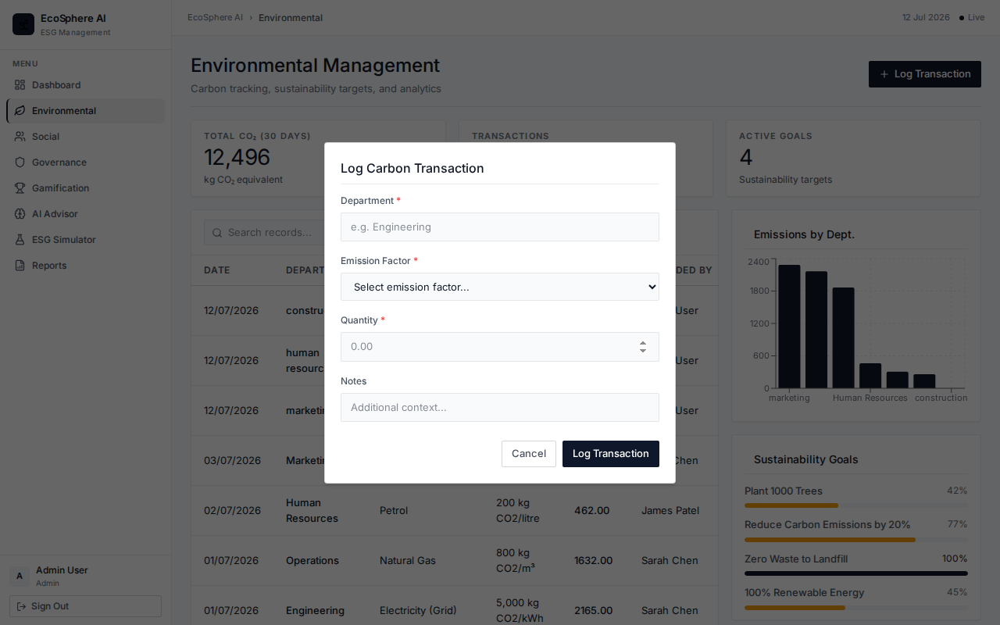

# EcoSphere AI

> Intelligent ESG Management Platform — Odoo Hackathon 2026

## Quick Start

### Prerequisites
- Node.js 18+
- PostgreSQL 14+
- OpenAI API key

### Backend Setup

```bash
cd ecosphere-backend
cp .env.example .env
# Edit .env with your DB credentials and OpenAI key

npm install

# Create and seed the database
psql -U postgres -c "CREATE DATABASE ecosphere_db;"
psql -U postgres -d ecosphere_db -f db/schema.sql
psql -U postgres -d ecosphere_db -f db/seed.sql

npm run dev
# Runs on http://localhost:5000
```

### Frontend Setup

```bash
cd ecosphere-frontend
npm install
npm run dev
# Runs on http://localhost:5173
```

### Demo Login

> **Note:** The Admin credentials (`admin@eco.com` / `admin123`) are already pre-filled on the login page for convenience. You can simply click **"Login"** to access the dashboard immediately without entering anything!

| Email | Password | Role |
|---|---|---|
| admin@eco.com | admin123 | Admin |
| sustain@eco.com | admin123 | Sustainability Manager |
| compliance@eco.com | admin123 | Compliance Officer |
| hr@eco.com | admin123 | HR Manager |
| employee@eco.com | admin123 | Employee |

## Architecture

```
ecosphere-backend/           Node.js + Express + PostgreSQL
  db/schema.sql              19 tables
  db/seed.sql                Realistic demo data
  src/
    config/                  DB + OpenAI clients
    middleware/              Auth (JWT), RBAC, Validation, Error handling
    models/                  User model
    controllers/             8 controllers
    routes/                  8 route modules
    services/                ESG Score, AI Advisor, Simulator

ecosphere-frontend/          React + Vite + Tailwind CSS
  src/
    pages/                   9 pages (Login, Dashboard, E, S, G, Gamification, AI, Simulator, Reports)
    components/              UI + Layout + Charts
    services/                API layer (Axios)
    store/                   Zustand auth store
    routes/                  Protected routes
```

## ESG Score Formula
```
Overall = (Environmental × 0.40) + (Social × 0.30) + (Governance × 0.30)
```
Weights are configurable via the `esg_weights` table.

## Platform Overview & Features

Our platform is divided into several powerful modules to tackle enterprise ESG challenges holistically. Below is a detailed breakdown of each feature, accompanied by interactive screenshots showing the application in action.

### 1. Centralized ESG Dashboard
The **Dashboard** serves as the command center for sustainability officers. It features high-level metrics, real-time KPI tracking, and interactive charts that visualize carbon emissions, social engagement, and governance compliance over time.
* **Interactive Tooltips**: Hovering over the graphs displays granular data points for precise analysis.


### 2. Environmental Management
The **Environmental** module tracks Scope 1, 2, and 3 emissions. Users can dynamically add new energy consumption logs, waste metrics, or water usage data.
* **Dynamic Modals**: Users can click "Record Transaction" to quickly log new data without leaving the page. 



### 3. Social Impact & Community
The **Social** module manages employee volunteering, community initiatives, and diversity metrics. 
* **Interactive Approval Flows**: Managers can click on individual social activities to approve or reject them directly from intuitive interactive modals.


### 4. Governance & Compliance
The **Governance** module ensures that the organization remains compliant with regional frameworks like GDPR, CSRD, and ISO certifications. It provides automated checklists, policy tracking, and audit readiness scores.


### 5. Gamification & Leaderboard
To drive grassroots employee engagement, the **Gamification** module tracks individual and departmental contributions to sustainability goals. Employees earn XP and badges for sustainable actions, fostering a culture of positive impact.


### 6. Groq-Powered AI Advisor
Our **AI Advisor** leverages the blazing-fast Groq LPU engine to provide real-time sustainability insights, tailored policy recommendations, and dynamic answers to complex ESG questions based on the enterprise's live data.


#### AI Advisor Output
By clicking "Generate Report", the Groq-powered model analyzes the latest enterprise metrics and outputs a comprehensive Executive ESG Report, highlighting strengths, vulnerabilities, and high-impact priority actions.


### 7. ESG Simulator
The **ESG Simulator** allows decision-makers to model the potential impact of future business choices—like adopting 100% renewable energy or altering supply chains.


#### Live Simulation Results
By adjusting the sliders, users can instantly see how hypothetical changes will affect their projected Environmental, Social, and Governance scores.


### 8. Reports & Analytics
Generate comprehensive, board-ready ESG reports for stakeholders and investors, highlighting compliance readiness, historical progress, and future trajectories.

