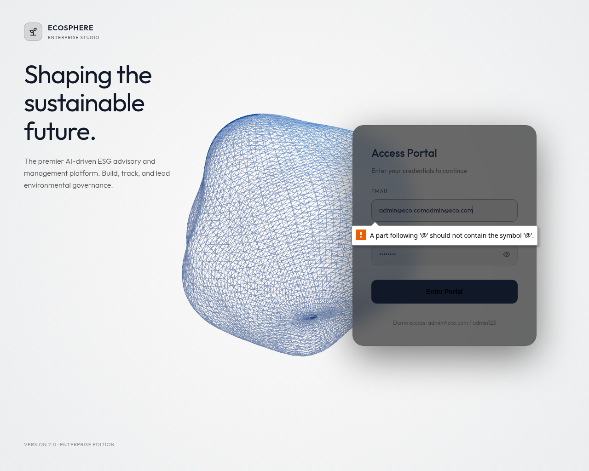
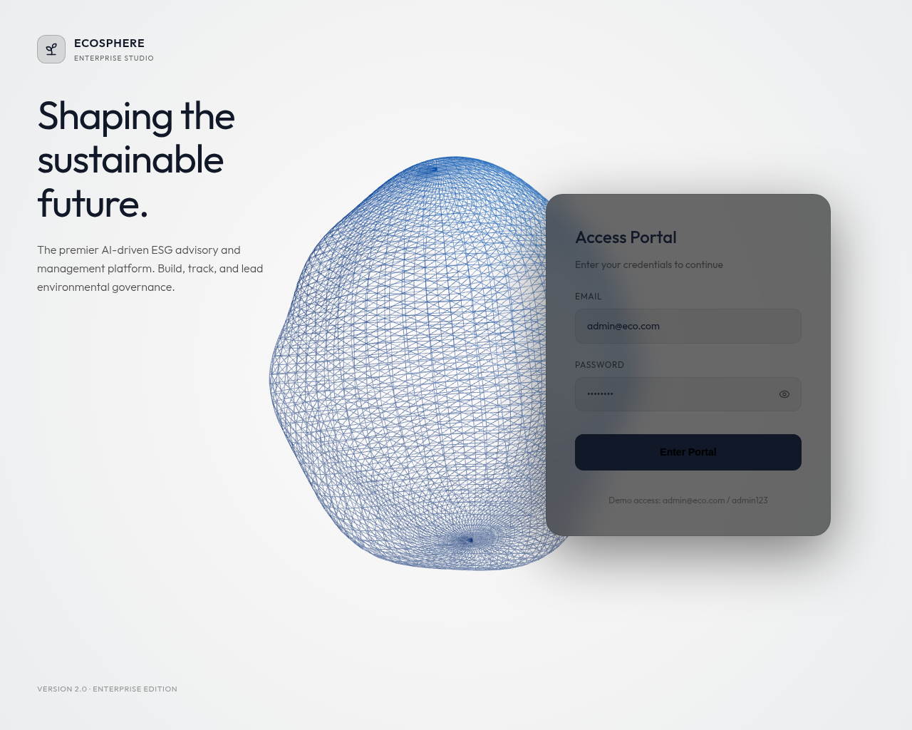
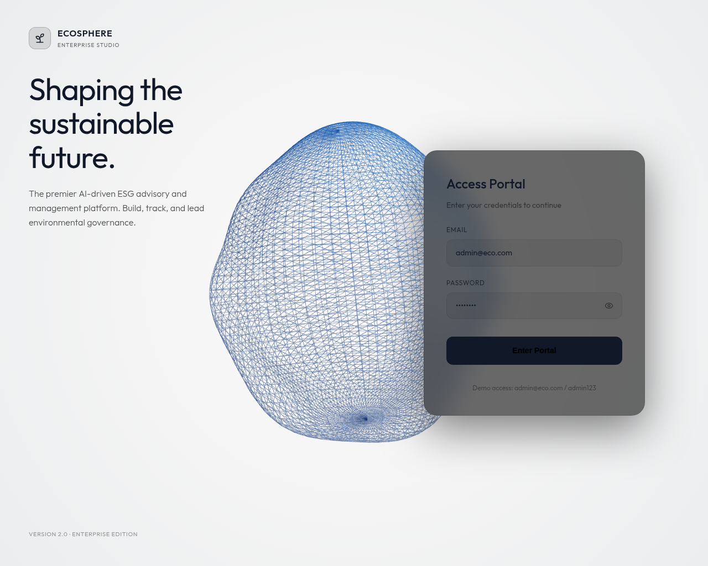
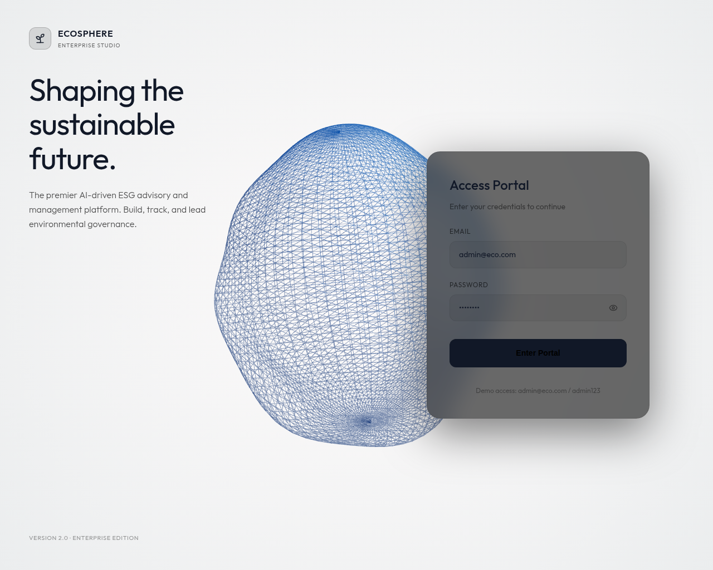
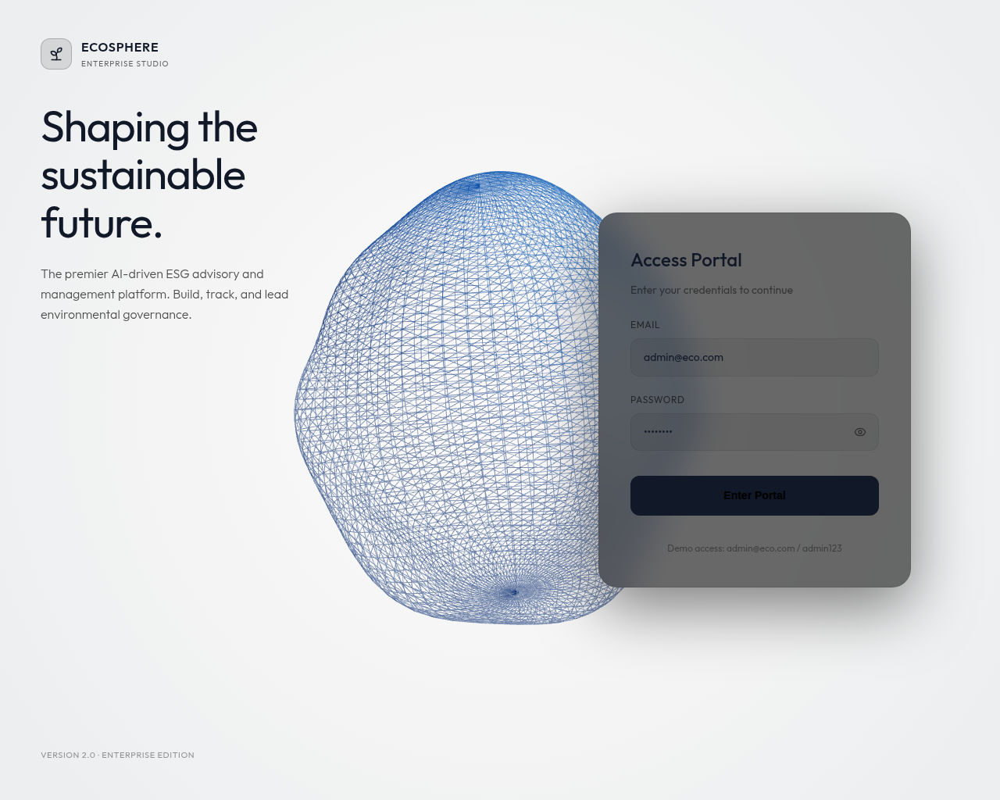
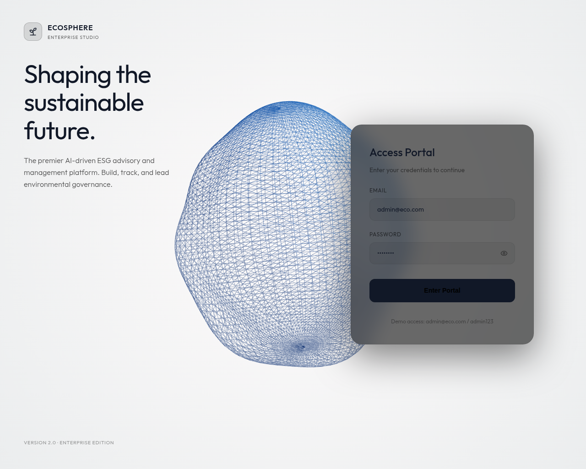
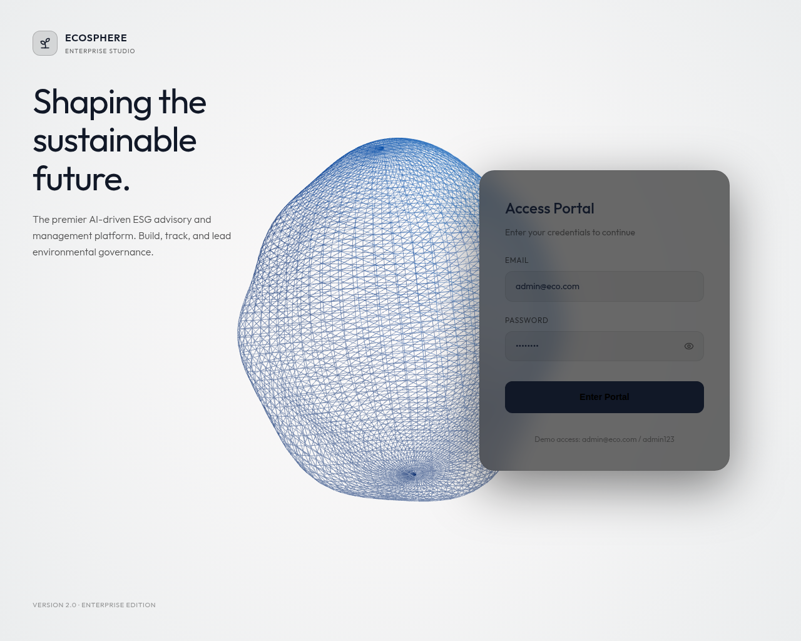
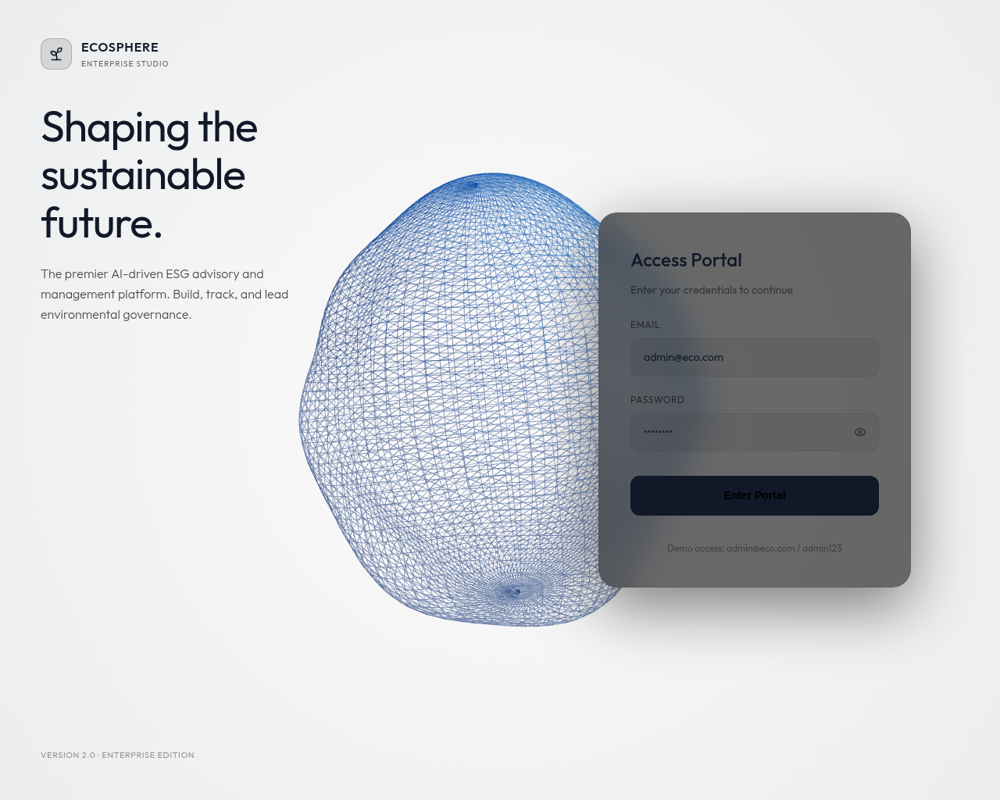

# EcoSphere AI

> Intelligent ESG Management Platform — Odoo Hackathon 2026

## Quick Start

### Prerequisites
- Node.js 18+
- PostgreSQL 14+
- OpenAI API key

### Backend Setup

```bash
cd ecosphere-backend
cp .env.example .env
# Edit .env with your DB credentials and OpenAI key

npm install

# Create and seed the database
psql -U postgres -c "CREATE DATABASE ecosphere_db;"
psql -U postgres -d ecosphere_db -f db/schema.sql
psql -U postgres -d ecosphere_db -f db/seed.sql

npm run dev
# Runs on http://localhost:5000
```

### Frontend Setup

```bash
cd ecosphere-frontend
npm install
npm run dev
# Runs on http://localhost:5173
```

### Demo Login
| Email | Password | Role |
|---|---|---|
| admin@eco.com | admin123 | Admin |
| sustain@eco.com | admin123 | Sustainability Manager |
| compliance@eco.com | admin123 | Compliance Officer |
| hr@eco.com | admin123 | HR Manager |
| employee@eco.com | admin123 | Employee |

## Architecture

```
ecosphere-backend/           Node.js + Express + PostgreSQL
  db/schema.sql              19 tables
  db/seed.sql                Realistic demo data
  src/
    config/                  DB + OpenAI clients
    middleware/              Auth (JWT), RBAC, Validation, Error handling
    models/                  User model
    controllers/             8 controllers
    routes/                  8 route modules
    services/                ESG Score, AI Advisor, Simulator

ecosphere-frontend/          React + Vite + Tailwind CSS
  src/
    pages/                   9 pages (Login, Dashboard, E, S, G, Gamification, AI, Simulator, Reports)
    components/              UI + Layout + Charts
    services/                API layer (Axios)
    store/                   Zustand auth store
    routes/                  Protected routes
```

## ESG Score Formula
```
Overall = (Environmental × 0.40) + (Social × 0.30) + (Governance × 0.30)
```
Weights are configurable via the `esg_weights` table.

## Platform Screenshots

### 1. Dashboard
The main command center for the Enterprise ESG Platform. It provides an at-a-glance view of overall scores, compliance status, and emissions trajectories.


### 2. Environmental Impact
Track Scope 1, 2, and 3 emissions, energy consumption, and environmental targets over time.


### 3. Social Metrics
Monitor community engagement, workplace safety, diversity, and internal CSR program participation.


### 4. Governance & Compliance
Ensure regulatory compliance with an overview of audits, open issues, and governance scoring metrics.


### 5. Gamification & Leaderboard
Drive employee engagement in sustainability via gamified leaderboards, XP, and badges.


### 6. AI Advisor
Interact with the Groq-powered AI for automated sustainability insights, policy recommendations, and dynamic answers to ESG questions.


### 7. ESG Simulator
Test potential business decisions (like adopting solar or shifting supply chains) and instantly simulate their impact on the company's overall ESG score.


### 8. Reports & Analytics
Generate comprehensive ESG reports for stakeholders and investors, highlighting compliance readiness and historical progress.

